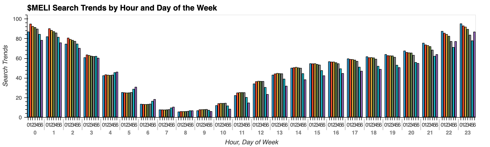
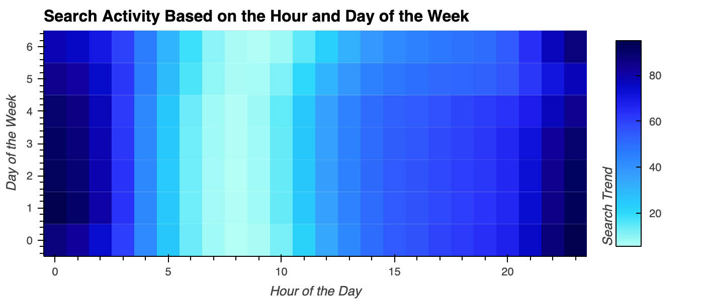
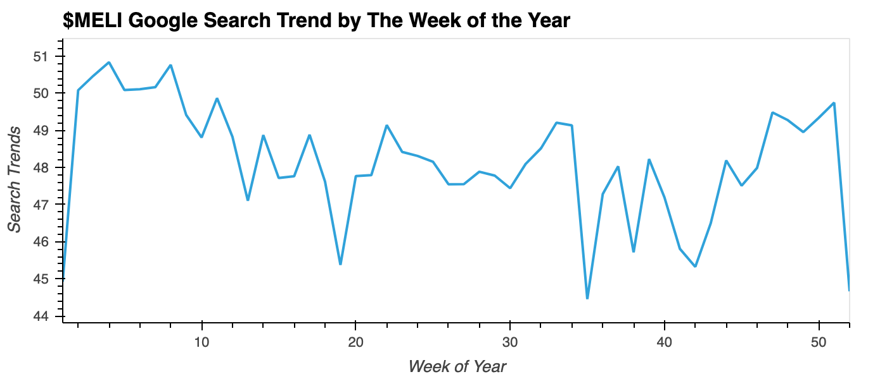
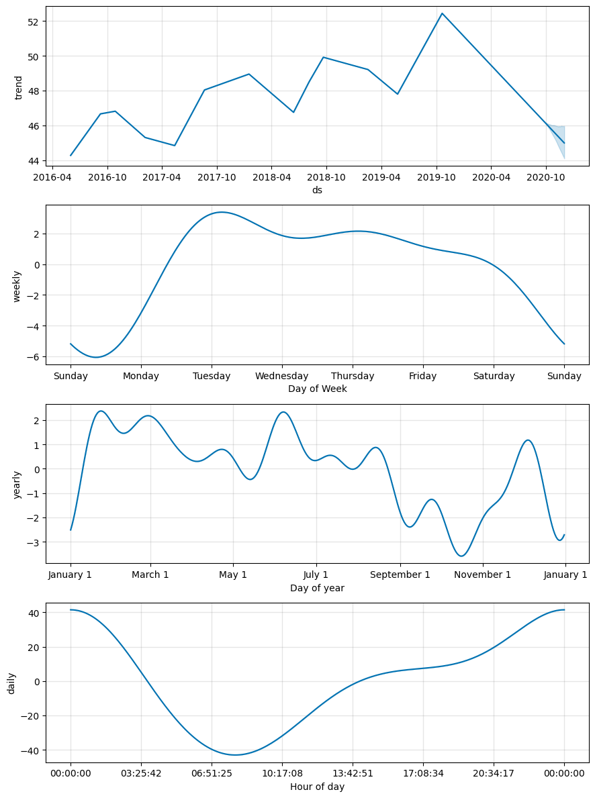

# ProphetForecast

Build sales forecast and user interest predictive models using `Prophet`.

### View Jupyter Notebook:

https://nbviewer.org/github/juil/ProphetForecast/blob/master/forecasting_net_prophet.ipynb

## Results

### 1. Analyze Google Traffic

| Period    	| Google Search Traffic 	|
|-----------	|-----------------------	|
| 2016-2020 	| 35172.5               	|
| May 2020  	| 38181                 	|

### 2. Mine Search Traffic for Seasonality






### 3. Test Correlation with Stock Price

|                      	| close    	| Search Trends 	| Lagged Search Trends 	| Stock Volatility 	| Hourly Stock Return 	|
|----------------------	|----------	|---------------	|----------------------	|------------------	|---------------------	|
| close                	| 1.000000 	| 0.011918      	| 0.012135             	| 0.477935         	| 0.022970            	|
| Search Trends        	| 0.011918 	| 1.000000      	| 0.384292             	| -0.180868        	| -0.029732           	|
| Lagged Search Trends 	| 0.012135 	| 0.384292      	| 1.000000             	| -0.119010        	| 0.018147            	|
| Stock Volatility     	| 0.477935 	| -0.180868     	| -0.119010            	| 1.000000         	| 0.046713            	|
| Hourly Stock Return  	| 0.022970 	| -0.029732     	| 0.018147             	| 0.046713         	| 1.000000            	|

### 4. Prophet Time Series Model



## Code

Rendered in [Google Colab](https://colab.research.google.com/github/juil/ProphetForecast/blob/master/forecasting_net_prophet.ipynb)

### Libraries

```py
# Install the required libraries
!pip install prophet
!pip install hvplot
!pip install holoviews
!pip install tabulate
!pip install numpy
```

**Starter code provided by edX.*